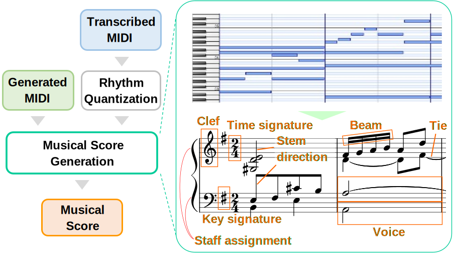
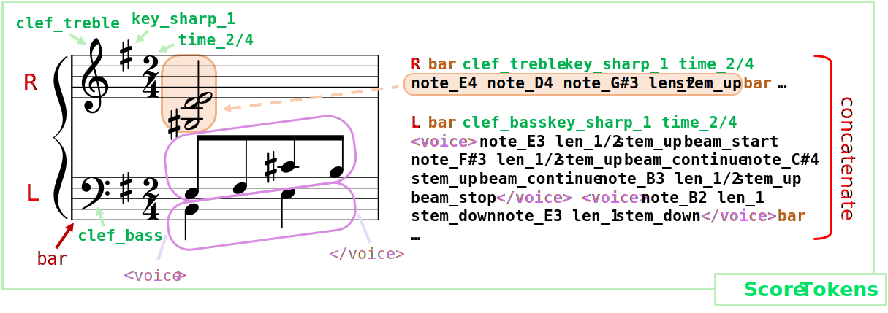
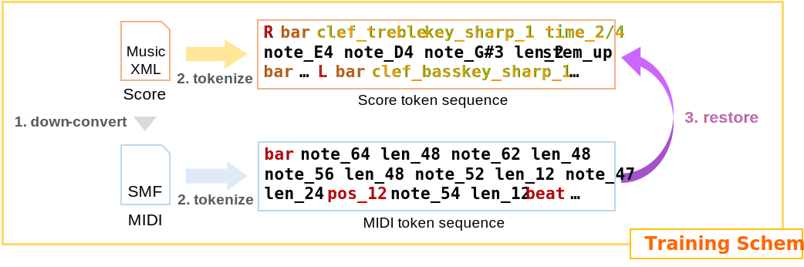
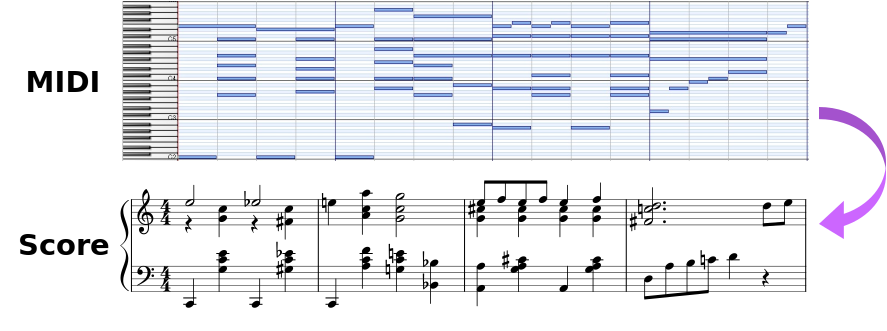
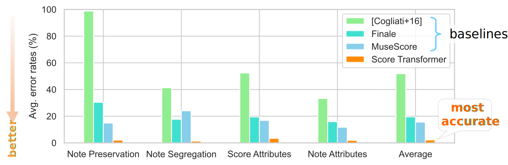
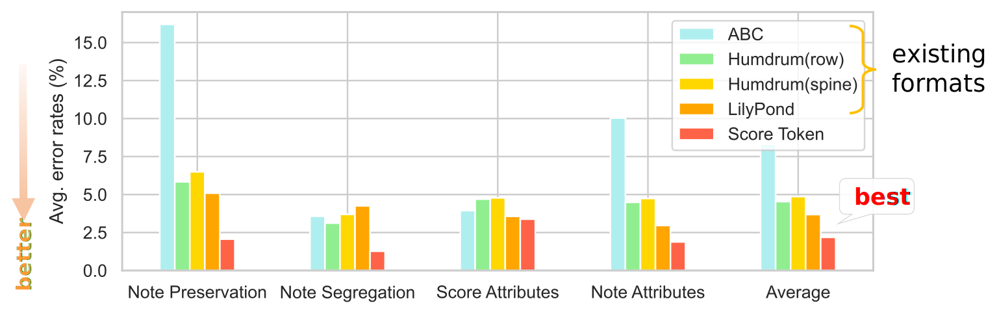

# **Score Transformer**
This is the official page for "Score Transformer: Generating Musical Score from Note-level Representation" (ACM Multimedia Asia 2021). 

[**Paper**](https://arxiv.org/abs/2112.00355) | [**Code**](https://github.com/suzuqn/ScoreTransformer) | [**Poster**](/pdf/ScoreTransformer_Poster.pdf)

## **Overview**
Musical scores contain various **musical elements**, which help us **visually comprehend** music.
<div style="text-align: center;"></div>

Generating musical scores from MIDI needs to **estimate a variety of musical elements** that are not represented in MIDI.

## **Score Tokenization**
We design **score token representation** to handle musical scores with transformers.


Tokenization tools are available on [**our repository**](https://github.com/suzuqn/ScoreTransformer)!

## **Training Scheme**

We train Transformer model to translate MIDI into musical scores.


This scheme requires musical scores only.

## **Example**
Trained model succeeds in generating appropriate musical scores out of MIDI.


More examples to come!

## **Performance**

Differences between the original and generated scores were measured based on [a metric](https://archives.ismir.net/ismir2017/paper/000131.pdf). 

### **Score Transformer vs. Baselines**

<span style="color:OrangeRed"><b>Score Transformer</b></span> **works significantly better** than baselines (including Finale and MuseScore).


### **Score Token vs. Existing score formats**

<span style="color:OrangeRed"><b>**Score token**</b></span> **outperforms** existing score formats (ABC, Humdurm, and LilyPond).



## **Citation**

If you find our work is helpful, please consider citing our work:
```
@inproceedings{suzuki2021,
 author = {Suzuki, Masahiro},
 title = {Score Transformer: Generating Musical Score from Note-level Representation},
 booktitle = {Proceedings of the 3rd ACM International Conference on Multimedia in Asia},
 year = {2021},
 pages = {31:1--31:7},
 doi = {10.1145/3469877.3490612}
}
```
